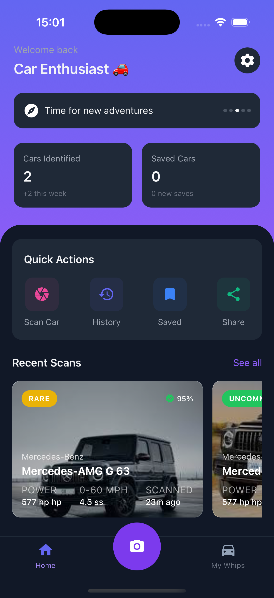
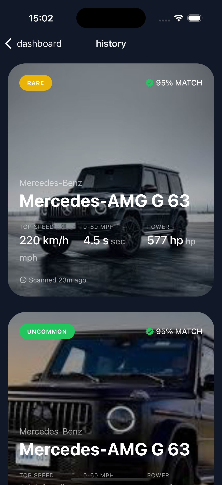

# What Car AI

What car AI is a mobile application that uses artificial intelligence to instantly identify and provide detailed information about cars from photos. Simply take a photo of any car, and get comprehensive details about its make, model, specifications, and more.

## 🚗 Key Features

- **Instant Car Recognition**: Powered by Claude AI for accurate vehicle identification
- **Detailed Specifications**: Get comprehensive information including:
  - Engine specifications
  - Performance metrics
  - Transmission details
  - Acceleration and top speed
  - Price estimates
- **Rarity Insights**: Learn how common or rare the identified vehicle is
- **Historical Context**: Get production years and interesting facts about each car
- **Clean Interface**: Intuitive UI with real-time scanning animation
- **Offline History**: Save your scanned cars for future reference

## App Screens

### Home Screen

 Home screen with a list of recent scans

### Scanning Screen

Real-time car scanning with animated interface

### Details Screen

Comprehensive car information and specifications

### History Screen

View all previously scanned cars

## 🎯 Perfect For

- Car enthusiasts
- Car spotters and photographers
- Automotive professionals
- Anyone curious about cars they see on the street

## Tech Stack
- React Native / Expo
- Claude AI API
- React Native Reanimated
- TailwindCSS

## 📱 Platform Support

Currently available for iOS and Android devices through the Expo platform.

## Prerequisites
- Node.js
- Expo CLI
- Claude API key
- google-services.json and GoogleService-info.plist from firebase

## Installation

1. Clone the repository
2. Install node modules - yarn or npm install
3. Create dev-client build - eas build --profile development
4. install build on physical device/emulator (android) or install on your ios simulator
5. start the server: yarn start or npm start
6. Proceed to adding in your secrets, see the format in the .env.example file
